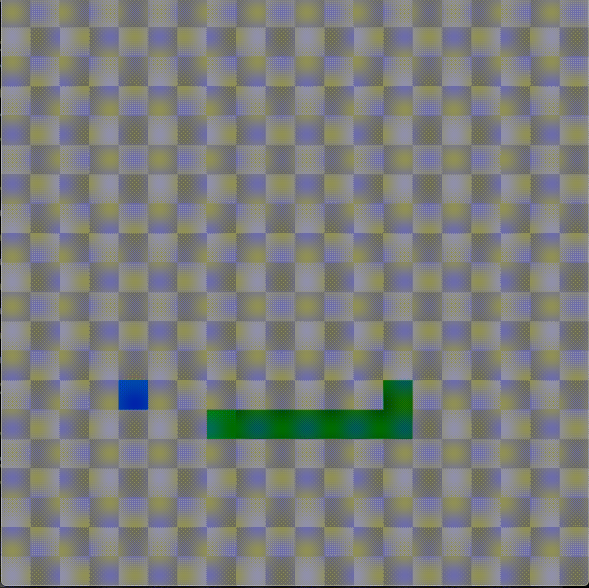

# Snake

An SDL2 implementation of the classic game Snake.


## Example



## Documentation

Documentation and more detailed examples are hosted on [Github Pages](https://joellefkowitz.github.io/snake).

## Tooling

Set the `CPPPATH` and `LIBPATH` environment variables:

```bash
export CPPPATH="/usr/include"
export LIBPATH="/usr/lib"
```

### Tests

To run tests:

```bash
scons tests
```

```bash
./dist/tests
```

### Documentation

To generate the documentation locally:

```sh
doxygen
```

### Linters

To run linters:

```sh
cspell . --dot
cppclean . --include-path $CPPPATH
cppcheck **/*.*pp -q --enable=all --suppressions-list=.cppcheck
scons --typecheck
```

### Formatters

To run formatters:

```sh
prettier . --write
clang-format -i **/*.*pp
```

## Contributing

Please read this repository's [Code of Conduct](CODE_OF_CONDUCT.md) which outlines our collaboration standards and the [Changelog](CHANGELOG.md) for details on breaking changes that have been made.

This repository adheres to semantic versioning standards. For more information on semantic versioning visit [SemVer](https://semver.org).

Bump2version is used to version and tag changes. For example:

```bash
bump2version patch
```

### Contributors

- [Joel Lefkowitz](https://github.com/joellefkowitz) - Initial work

## Remarks

Lots of love to the open source community!

<p align='center'>
    
    
    
</p>
